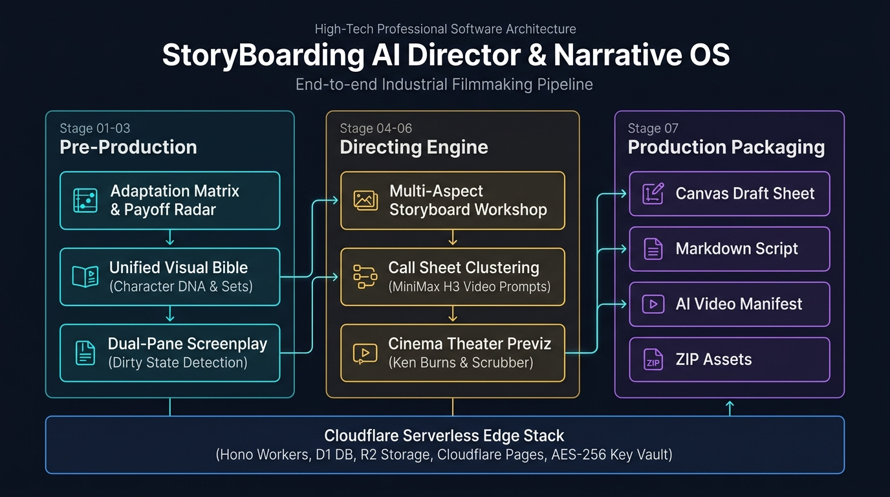

# 🎬 StoryBoarding · AI Director & Narrative OS (AI 商业短剧导演工作站)

[English](./README_EN.md) | 简体中文

> **剧本即代码 (Executable Script) · 工业级分镜编排 · Reelbench 规范体系 · 0ms 边缘冷启动**  
> 
> 面向影视导演、短剧编剧与 AI 创作者的一站式工业级工作站，提供从「原著文学抽核、四象限结构取舍、爽点节拍雷达、剧组视听设定集、文学分镜双向联动」到「顺场表排期、沉浸式影院预演与全套制片资产交付」的全链路能力。  
> **基于 Cloudflare 全栈 Serverless 边缘架构构建 (Next.js + Hono + D1 + R2 + Pages)。**

---

## 🏗️ 系统架构逻辑 (System Architecture)

系统采用**“剧本即代码 (Executable Script)”**的工程设计思想，将文学文本抽象为结构化的分镜状态树（State Tree）。整个生产流水线划分为 **7 大核心工序（Stages）**，打通前期筹备、导演规划到后期交付的全部数据链路：



---

## 💎 核心能力模块 (Core Modules)

### 1. ⚖️ STAGE 01 · 大纲改编与爽点雷达工作室
- **商业短剧智能抽核**：从万字长篇或大纲中提炼核心戏剧矛盾与观众商业钩子；
- **四象限结构取舍 (Adaptation Tradeoffs)**：
  - **保留 (Keep)**：原著最具辨识度的核心高光与标志性视觉；
  - **砍掉 (Cut)**：冗长支线与低效过渡；
  - **合并 (Merge)**：角色合并与场景聚合；
  - **风险 (Risk)**：逻辑漏洞与拍摄预算陷阱；
- **Gate 2 爽点节拍门控 (Payoff Matrix Gatekeeper)**：
  - 自动检测全剧爽点真空间隔，算法强制保证 `maxBeatGap ≤ 3` 集；
  - 支持一键智能推演并补齐真空期爽点；
- **剧本围读 Markdown 会审通告**：一键生成标准化会审文档，支持复制至剪贴板或下载 `.md` 文件。

---

### 2. 🎭 STAGE 02 · 剧组前期视觉设定集 (Unified Visual Bible)
- **单一真实数据源 (Single Source of Truth)**：彻底消除角色库与设定集割裂的冗余；
- **角色定妆档案 (Character DNA)**：
  - 生成 16:9 三区定妆图（特写 / 全身 / 动态姿势）；
  - 沉淀纯英文 Visual DNA 提示词基准，解决多镜头跨集“换脸”漂移；
  - 角色声学参数（音色、共鸣、语速与英文 TTS Acoustic Prompt）；
- **场景空间锚点 (Environment Anchors)**：
  - 固化全剧关键地理空间的建筑材质、自然光/顶光/夜戏光影变体，定义 3-5 处实物对齐锚点；
- **道具特写档案 (Prop Specifications)**：
  - 手持级、桌面级、家具级三级尺度规范与状态变体（开 / 合 / 破损）。

---

### 3. ✍️ STAGE 03 · 文学母本与分镜双向自愈
- **双栏响应式工作台**：左侧文学剧本流与右侧故事板分镜毫秒级增量联动；
- **短剧呼吸感监控**：单句台词超过 35 字符自动黄色预警，杜绝长篇说教；
- **单节拍一键拆镜**：支持将单个戏剧节拍一分为二，切分为景别互补的双镜头组合；
- **增量脏状态检测 (Dirty State)**：修改文学台词或动作后，右侧关联镜头自动标黄提示「待重绘」，支持原位增量冲印，保留未修改镜头。

---

### 4. 📋 STAGE 04 & 05 · 故事板网格与顺场表排期
- **故事板网格工坊 (Storyboard Panel)**：
  - 支持 4:3、16:9 电影横屏与 9:16 短剧竖屏画幅自适应切换；
  - HUD 运镜参数、景别标签与镜头锁定（Lock）防护，支持一键全选锁定/解锁；
- **顺场表制片管理 (Call Sheet View)**：
  - 按「空间地点 + 光影氛围」聚类归并生产批次（B1, B2...），统计每批时长与镜数；
  - 批次卡片支持独立折叠展开与全部收起；
  - **MiniMax Hailuo H3 视频提示词**：一键生成并复制连贯的多镜头多模态生成指令；
  - **CSV 顺场排期表**：一键导出标准 Excel / CSV 制片表格。

---

### 5. 🎬 STAGE 06 · 好莱坞级放映影院 (Cinema Theater)
- **纯净黑场动态预演**：全屏自适应比例播放，搭载 Ken Burns 运镜动态视差；
- **多模态对白呈现**：台词打字机字幕与画面精准同步；
- **好莱坞级分段胶囊进度条 (Segmented Scrubber)**：直观指示当前镜号与单镜流逝进度；
- **全套导演键盘快捷键**：
  - `Space`：播放 / 暂停试映
  - `←` / `→`：快速切镜跳转
  - `C`：字幕打字机开关
  - `B`：全剧连播模式开关 (Binge Previz)
  - `ESC`：退出放映并精准高亮工作台当前镜头

---

### 6. 🛡️ 工业级安全与多租户权限隔离
- **公共体验账号零资源泄露红线**：
  - 在 AI 智能拆镜、3步向导、剧组设定集、脚本导入、爆点重构等耗费模型资源的入口处全面接入 `checkAuthAndKey` 前置拦截；
  - 拦截时弹出友好注册引导，**绝不关闭弹窗、绝不丢失用户当前已输入的故事内容**；
- **AES-256-GCM 密文保险箱**：用户自填的 API Key 经独立 Salt 加密后入库，前端永不返回明文；
- **零降级架构**：杜绝向前端暴露公共硬编码 API Key，保障服务稳定性与多租户隔离。

---

### 7. 📦 STAGE 07 · 工业级制片交付物分卷导出
- **标准化 5 大工业级交付物**：
  1. 🖼️ **16:9 故事板工作草图打样单 (PNG Draft)**（客户端 Canvas 秒级离线合成）；
  2. 📝 **导演多集分卷分镜头工业台本 (Markdown)**（按 `## 🎬 EPISODE 01` 分卷排版，附带集尾卡点与片长汇总）；
  3. 🎯 **Midjourney / DALL-E 3 导演全局总控提示词 (Global Prompt)**；
  4. 🤖 **可灵 Kling / Runway Gen-3 视频生成清单 (AI Video Manifest)**；
  5. 📦 **制片工程全量资产打包 (ZIP Archive)**（按集数子文件夹规范归档高清图）。

---

## 🛠️ 技术栈与底层选型 (Technology Stack)

| 架构层级 | 技术选型 | 核心职责 |
| :--- | :--- | :--- |
| **前端框架** | **Next.js 14 / React 18 / Tailwind CSS** | 现代化响应式双栏工作台，全组件类型安全 |
| **状态管理** | **Zustand** | 轻量响应式管理分镜状态树、剧集索引与认证状态 |
| **边缘运行时** | **Hono (TypeScript) on Cloudflare Workers** | 0ms 冷启动、高并发边缘 API 网关 |
| **边缘数据库** | **Cloudflare D1 ➕ Drizzle ORM** | 分布式 Serverless SQLite，全自动类型迁移 |
| **对象存储** | **Cloudflare R2** | S3 兼容海量媒体存储，零数据出口流量费 (Zero Egress) |
| **多模态模型集成** | **OpenRouter / MiniMax H3 / Seedream** | 工业级提示词编译器与生图/视频引擎调度 |

---

## 🚀 本地开发与快速上手

本项目摒弃了笨重复杂的本地环境依赖，基于纯 Node.js 与 Cloudflare `wrangler` 驱动。

### 1. 安装依赖

```bash
# 安装后端依赖
cd backend && npm install

# 安装前端依赖
cd ../frontend && npm install
```

### 2. 启动本地开发服务

```bash
# 终端 1：启动边缘后端 Worker (默认端口: http://localhost:8787)
cd backend && npm run dev

# 终端 2：启动前端应用 (默认端口: http://localhost:3000)
cd frontend && npm run dev
```

### 3. 一键部署到 Cloudflare

#### 部署后端 Workers:
```bash
cd backend
npx wrangler d1 create storyboard_db
npx wrangler r2 bucket create storyboard-assets
npm run deploy
```

#### 部署前端 Pages:
```bash
cd frontend
npm run build
npx wrangler pages deploy .next
```

---

## 📄 许可证 (License)

本项目基于 [MIT License](LICENSE) 开源发布。
