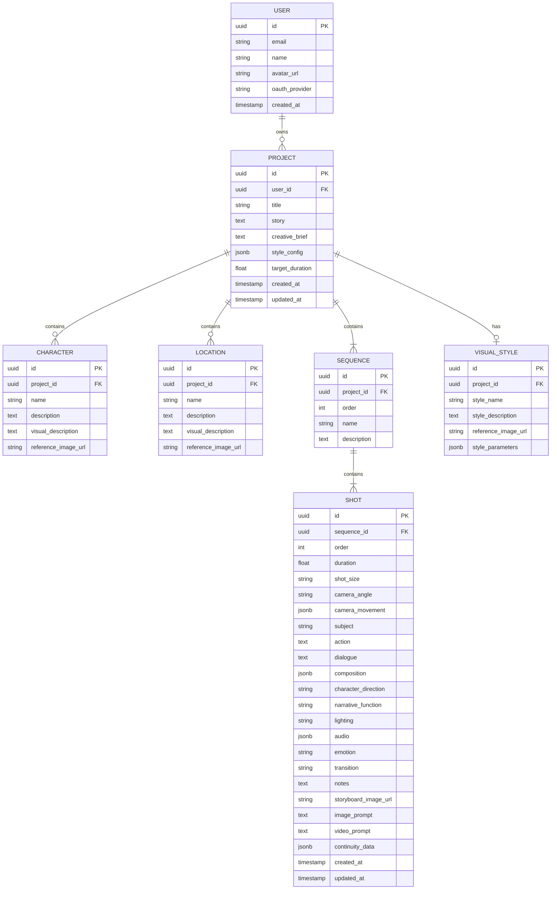
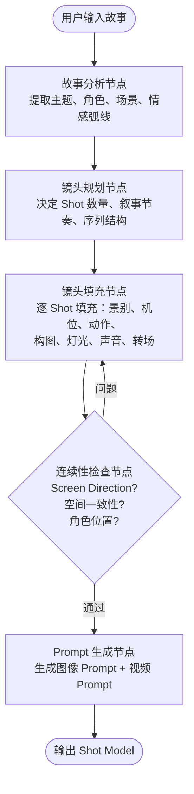
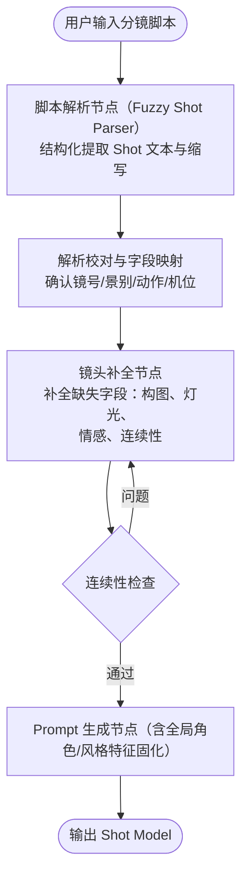
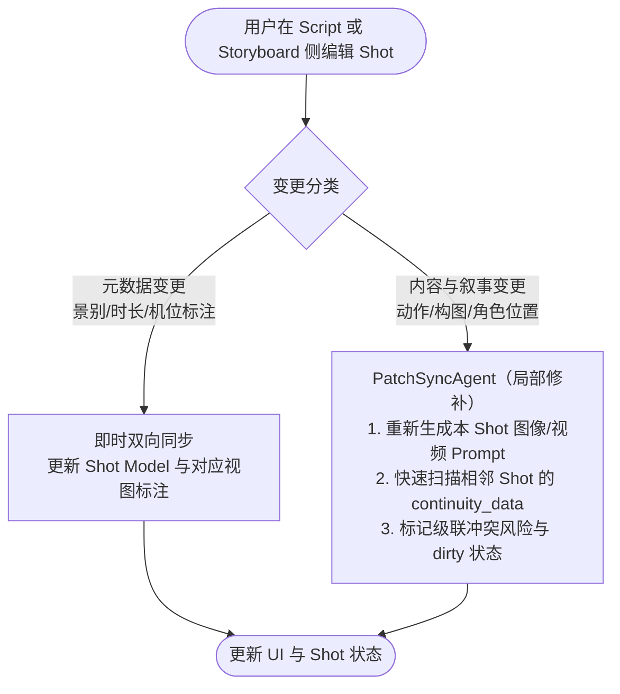

# AI Director Workspace — 实施计划

基于[产品方案文档](file:///Users/corlin/2026/StoryBoarding/AI%20Storyboard%20%E4%BA%A7%E5%93%81%E6%96%B9%E6%A1%88%E4%BF%AE%E6%AD%A3%EF%BC%9A%E5%88%86%E9%95%9C%E5%A4%B4%E8%84%9A%E6%9C%AC%E4%B8%8E%E6%95%85%E4%BA%8B%E6%9D%BF%E5%8F%8C%E5%90%91%E5%8D%8F%E5%90%8C.md)构建 **AI Director Workspace**——一套镜头数据，两种创作语言，双向编辑，始终同步。

---

## 确认的设计决策

| # | 决策项 | 结论 |
|---|--------|------|
| 1 | 目标平台 | Web 应用 |
| 2 | MVP 范围 | 起点 A（故事→双向生成）+ 起点 B（脚本→Storyboard） |
| 3 | LLM 调用 | 兼容 OpenAI API + Anthropic API 语法 |
| 4 | 图像生成 | API 抽象层，用户自配模型和 Key |
| 5 | 前端框架 | React (Next.js) |
| 6 | 后端框架 | Python 3.11+ (FastAPI) |
| 7 | Python 包与环境管理 | **全流程强制使用 `uv` 管理** (`uv pip`, `uv run`, `uv venv`) |
| 8 | 数据库 | PostgreSQL + JSONB |
| 9 | Storyboard 渲染 | MVP 图片 + 标注层，V2 Canvas |
| 10 | 双向同步 | 分层同步：元数据即时，图片手动触发 |
| 11 | 用户系统 | OAuth 认证 |
| 12 | Director Agent | LangGraph |
| 13 | UI 组件库 | Tailwind CSS + shadcn/ui |
| 14 | 图片存储 | S3 兼容对象存储 |
| 15 | 部署 | Docker Compose 自部署 |
| 16 | 代码结构 | Monorepo |
| 17 | Timeline | MVP 简化版只读 |
| 18 | 导出 | Storyboard Page + Shot Script + Shot Generation Package |

---

## 系统架构

```mermaid
graph TB
    subgraph Frontend["前端 (Next.js)"]
        Auth[认证页面]
        Dashboard[项目仪表板]
        Workspace[工作台]
        Settings[设置 - AI Provider 配置]
        
        subgraph StateManagement["状态与并发控制"]
            Zustand["细粒度原子状态 (Zustand Slices)"]
            ShotLocks["Shot 级乐观锁 (防编辑冲突)"]
        end

        subgraph WorkspaceDetail["工作台布局"]
            TopBar[顶栏: 故事 / 角色 / 场景 / 风格]
            ScriptView[左面板: Script View]
            StoryboardView[右面板: Storyboard View]
            TimelineBar[底栏: Timeline 时长汇总]
        end
        Workspace --> StateManagement
    end

    subgraph Backend["后端 (FastAPI)"]
        API[API 路由层 + SSE 流式推送]
        Services[服务层]
        Agents[Agent 层 - LangGraph]
        Providers[Provider 层]
        
        subgraph ConcurrencyControl["并发与限流"]
            TaskQueue["API 请求队列 (Task Queue)"]
            RateLimiter["并发限制器 (Semaphore)"]
        end

        subgraph AgentDetail["Director Agent"]
            StoryAnalyzer[故事分析节点]
            ShotPlanner[镜头规划节点]
            ShotDetailer[镜头填充节点 (滑动窗口上下文)]
            ContinuityChecker[连续性检查节点]
            PromptGenerator[Prompt 生成节点]
        end
    end

    subgraph Storage["存储"]
        PG[(PostgreSQL)]
        S3[(S3 兼容对象存储)]
    end

    subgraph ExternalAI["外部 AI 服务"]
        LLM[LLM API - OpenAI / Anthropic 兼容]
        ImageGen[图像生成 API - 用户自配]
    end

    Frontend --> API
    API --> Services
    Services --> Agents
    Services --> Providers
    Providers --> ConcurrencyControl
    ConcurrencyControl --> LLM
    ConcurrencyControl --> ImageGen
    Providers --> S3
    Services --> PG
```

---

## 核心数据模型：Shot Model

Shot Model 是整个产品的唯一真实数据源。Script View 和 Storyboard View 都是它的渲染。



### Shot 的 JSONB 字段详细结构

```json
{
  "camera_movement": {
    "type": "tracking_right",
    "speed": "slow",
    "secondary": "push_in"
  },
  "composition": {
    "subject_position": "left_foreground",
    "focal_point": "right_background",
    "depth_elements": ["table_legs"],
    "annotations": [
      {"type": "motion_arrow", "color": "red", "from": [0.1, 0.8], "to": [0.5, 0.8]},
      {"type": "camera_arrow", "color": "blue", "from": [0.1, 0.5], "to": [0.4, 0.5]},
      {"type": "focal_marker", "color": "green", "position": [0.7, 0.3]}
    ]
  },
  "audio": {
    "music": "pause",
    "sfx": ["footsteps_stop"],
    "ambient": "kitchen_night"
  },
  "continuity_data": {
    "screen_direction": "left_to_right",
    "character_positions": {"mouse": "frame_left"},
    "props": ["oil_bottle"],
    "eyeline": "upward"
  }
}
```

---

## Monorepo 项目结构

```text
StoryBoarding/
│
├── docker-compose.yml
├── .env.example
├── README.md
│
├── frontend/
│   ├── Dockerfile
│   ├── package.json
│   ├── next.config.js
│   ├── tailwind.config.ts
│   ├── tsconfig.json
│   │
│   └── src/
│       ├── app/
│       │   ├── layout.tsx
│       │   ├── page.tsx                    # Landing / 登录
│       │   ├── dashboard/
│       │   │   └── page.tsx                # 项目列表
│       │   ├── workspace/
│       │   │   └── [projectId]/
│       │   │       └── page.tsx            # 主工作台
│       │   └── settings/
│       │       └── page.tsx                # AI Provider 配置
│       │
│       ├── components/
│       │   ├── ui/                         # shadcn/ui 组件
│       │   ├── auth/
│       │   │   └── LoginButton.tsx
│       │   ├── project/
│       │   │   ├── ProjectCard.tsx
│       │   │   └── CreateProjectDialog.tsx
│       │   ├── workspace/
│       │   │   ├── WorkspaceLayout.tsx      # 双面板主布局
│       │   │   ├── TopBar.tsx               # 故事/角色/场景/风格
│       │   │   └── GenerateControls.tsx     # 生成/同步按钮
│       │   ├── script-view/
│       │   │   ├── ScriptPanel.tsx          # 左面板容器
│       │   │   ├── ShotScriptCard.tsx       # 单个 Shot 脚本卡片
│       │   │   ├── ShotScriptEditor.tsx     # Shot 字段编辑器
│       │   │   └── ScriptImporter.tsx       # 脚本批量导入
│       │   ├── storyboard-view/
│       │   │   ├── StoryboardPanel.tsx      # 右面板容器
│       │   │   ├── StoryboardCell.tsx       # 单格 Storyboard
│       │   │   ├── AnnotationOverlay.tsx    # 标注覆盖层
│       │   │   └── ImagePlaceholder.tsx     # 未生成图片占位
│       │   ├── timeline/
│       │   │   └── TimelineBar.tsx          # 简化版时间轴
│       │   └── export/
│       │       └── ExportDialog.tsx         # 导出对话框
│       │
│       ├── hooks/
│       │   ├── useProject.ts
│       │   ├── useShots.ts
│       │   ├── useSyncStatus.ts
│       │   └── useGeneration.ts
│       │
│       ├── stores/
│       │   ├── projectStore.ts              # Zustand 项目状态
│       │   └── shotStore.ts                 # Zustand Shot 状态
│       │
│       ├── lib/
│       │   ├── api.ts                       # 后端 API 客户端
│       │   └── utils.ts
│       │
│       └── types/
│           ├── shot.ts                      # Shot Model TypeScript 类型
│           ├── project.ts
│           └── api.ts
│
├── backend/
│   ├── Dockerfile
│   ├── pyproject.toml
│   ├── alembic.ini
│   ├── alembic/
│   │   └── versions/
│   │
│   └── app/
│       ├── main.py                          # FastAPI 入口
│       ├── config.py                        # 环境变量配置
│       │
│       ├── api/
│       │   ├── __init__.py
│       │   ├── auth.py                      # OAuth 路由
│       │   ├── projects.py                  # 项目 CRUD
│       │   ├── shots.py                     # Shot CRUD
│       │   ├── generation.py                # AI 生成路由
│       │   ├── export.py                    # 导出路由
│       │   └── providers.py                 # Provider 配置路由
│       │
│       ├── models/
│       │   ├── __init__.py
│       │   ├── user.py                      # SQLAlchemy User
│       │   ├── project.py                   # SQLAlchemy Project
│       │   ├── shot.py                      # SQLAlchemy Shot
│       │   └── schemas.py                   # Pydantic 请求/响应模型
│       │
│       ├── services/
│       │   ├── __init__.py
│       │   ├── project_service.py
│       │   ├── shot_service.py
│       │   ├── sync_service.py              # 分层同步逻辑
│       │   └── export_service.py            # 导出逻辑
│       │
│       ├── agents/
│       │   ├── __init__.py
│       │   ├── director/
│       │   │   ├── __init__.py
│       │   │   ├── graph.py                 # LangGraph 主图定义
│       │   │   ├── state.py                 # Agent 状态定义
│       │   │   ├── nodes/
│       │   │   │   ├── story_analyzer.py    # 故事分析节点
│       │   │   │   ├── shot_planner.py      # 镜头规划节点
│       │   │   │   ├── shot_detailer.py     # 镜头填充节点
│       │   │   │   ├── continuity_checker.py# 连续性检查节点
│       │   │   │   └── prompt_generator.py  # 图像/视频 Prompt 节点
│       │   │   └── prompts/
│       │   │       ├── story_analysis.py    # 故事分析 Prompt 模板
│       │   │       ├── shot_planning.py
│       │   │       ├── shot_detailing.py
│       │   │       ├── continuity.py
│       │   │       └── image_prompt.py
│       │   └── sync/
│       │       ├── __init__.py
│       │       └── graph.py                 # 编辑同步 Agent
│       │
│       ├── providers/
│       │   ├── __init__.py
│       │   ├── llm/
│       │   │   ├── __init__.py
│       │   │   ├── base.py                  # LLM 抽象基类
│       │   │   ├── openai_compatible.py     # OpenAI 兼容调用
│       │   │   └── anthropic_compatible.py  # Anthropic 兼容调用
│       │   ├── image/
│       │   │   ├── __init__.py
│       │   │   ├── base.py                  # 图像生成抽象基类
│       │   │   ├── openai_dalle.py          # DALL·E
│       │   │   ├── stability.py             # Stable Diffusion API
│       │   │   └── flux.py                  # Flux API
│       │   └── storage/
│       │       ├── __init__.py
│       │       ├── base.py                  # 存储抽象基类
│       │       └── s3_compatible.py         # S3/MinIO/R2
│       │
│       └── db/
│           ├── __init__.py
│           ├── session.py                   # 数据库会话管理
│           └── base.py                      # SQLAlchemy Base
│
└── shared/
    └── schema/
        └── shot_model.json                  # Shot Model JSON Schema（前后端共享）
```

---

## Director Agent（LangGraph）工作流

### 起点 A：故事 → 双向生成



### 起点 B：脚本 → Storyboard



### 编辑同步流与局部修补（PatchSyncAgent）



---

## 视觉一致性策略（Visual Consistency Strategy）

在 MVP 用户自配通用图像生成 API 的前提下，通过以下分层策略保障 Storyboard 画面一致性：

1. **Global Style & Character Prefix 注入**：
   - 提取项目 `Visual Style` 与 `Character Bible` 的显式描述（例如：*2D minimalist storyboard sketch, black & white line art with selective red accent, character [Mouse]: brown small field mouse with notched left ear*）。
   - 将该特征前缀强制注入到每一个 Shot 的 `image_prompt` 起始位置。
2. **Shot-to-Shot Context Anchoring（相邻镜头锚定）**：
   - 生成 `image_prompt` 时包含前一个 Shot 的主要构图与环境光线基调，确保空间连续。
3. **Reference Image Injection（预留图生图/参考图槽位）**：
   - 在 Character/Location Bible 中支持用户上传参考图，作为支持 Image-to-Image / IP-Adapter / ControlNet 模型的基础参考。

---

## API 设计

### 认证

| 方法 | 路径 | 描述 |
|------|------|------|
| GET | `/api/auth/{provider}` | 发起 OAuth 登录 |
| GET | `/api/auth/{provider}/callback` | OAuth 回调 |
| GET | `/api/auth/me` | 获取当前用户 |
| POST | `/api/auth/logout` | 登出 |

### 项目

| 方法 | 路径 | 描述 |
|------|------|------|
| GET | `/api/projects` | 获取用户所有项目 |
| POST | `/api/projects` | 创建项目 |
| GET | `/api/projects/{id}` | 获取项目详情（含所有 Shot） |
| PUT | `/api/projects/{id}` | 更新项目基本信息 |
| DELETE | `/api/projects/{id}` | 删除项目 |

### Shot

| 方法 | 路径 | 描述 |
|------|------|------|
| GET | `/api/projects/{id}/shots` | 获取项目所有 Shot |
| POST | `/api/projects/{id}/shots` | 手动添加 Shot |
| PUT | `/api/projects/{id}/shots/{shotId}` | 更新单个 Shot（自动触发 PatchSync） |
| DELETE | `/api/projects/{id}/shots/{shotId}` | 删除 Shot |
| PUT | `/api/projects/{id}/shots/reorder` | 重新排序 Shot |

### AI 生成与实时流

| 方法 | 路径 | 描述 |
|------|------|------|
| POST | `/api/generate/from-story` | 起点 A：故事 → Shot Model |
| POST | `/api/generate/from-script` | 起点 B：脚本解析与校验预览 → Shot Model |
| GET | `/api/generate/stream/{taskId}` | **SSE 流式端点**：实时推送 LangGraph 节点运行进度与 Shot 生成详情 |
| POST | `/api/generate/images` | 批量生成 Storyboard 图片 |
| POST | `/api/generate/images/{shotId}` | 单个 Shot 重新生成图片 |
| GET | `/api/generate/status/{taskId}` | 查询生成任务状态（兜底轮询） |

### 导出

| 方法 | 路径 | 描述 |
|------|------|------|
| POST | `/api/export/storyboard/{projectId}` | 导出 Storyboard Page（PNG/PDF）|
| POST | `/api/export/script/{projectId}` | 导出 Shot Script（Markdown/PDF）|
| POST | `/api/export/package/{projectId}` | 导出 Shot Generation Package |

### Provider 配置

| 方法 | 路径 | 描述 |
|------|------|------|
| GET | `/api/settings/providers` | 获取用户 AI Provider 配置 |
| PUT | `/api/settings/providers/llm` | 更新 LLM Provider 配置 |
| PUT | `/api/settings/providers/image` | 更新图像生成 Provider 配置 |
| POST | `/api/settings/providers/test` | 测试 Provider 连通性 |

---

## 前端工作台 UI 布局

```text
┌──────────────────────────────────────────────────────────────┐
│  🎬 Project Title    [故事] [角色] [场景] [风格]    [导出 ▾]  │
├─────────────────────────┬────────────────────────────────────┤
│                         │                                    │
│   📝 Script View        │   🎨 Storyboard View               │
│                         │                                    │
│   ┌───────────────────┐ │   ┌──────┐ ┌──────┐ ┌──────┐     │
│   │ SHOT 01           │ │   │      │ │      │ │      │     │
│   │ WS · 2.0s         │ │   │  01  │ │  02  │ │  03  │     │
│   │ 老鼠从门缝进入     │ │   │      │ │      │ │      │     │
│   │ TRACK →            │ │   │WS 2s │ │LA 1.5│ │MS 2s │     │
│   └───────────────────┘ │   └──────┘ └──────┘ └──────┘     │
│   ┌───────────────────┐ │   ┌──────┐ ┌──────┐ ┌──────┐     │
│   │ SHOT 02           │ │   │      │ │      │ │      │     │
│   │ LA · 1.5s         │ │   │  04  │ │  05  │ │  06  │     │
│   │ 沿墙根低角度移动   │ │   │      │ │      │ │      │     │
│   │ STATIC             │ │   │CU 2s │ │MS 3s │ │MCU 2s│     │
│   └───────────────────┘ │   └──────┘ └──────┘ └──────┘     │
│   ┌───────────────────┐ │                                    │
│   │ SHOT 03  ⚠ dirty  │ │   [🔄 重新生成选中图片]            │
│   │ ...                │ │   [🔄 重新生成全部 dirty]          │
│   └───────────────────┘ │                                    │
│                         │                                    │
│  [+ 添加 Shot]          │                                    │
├─────────────────────────┴────────────────────────────────────┤
│  ▶ Timeline  [01|2s][02|1.5s][03|2s][04|2s][05|3s]...  30s  │
└──────────────────────────────────────────────────────────────┘
```

**交互要点：**
- 点击 Script 侧某个 Shot → Storyboard 侧高亮对应格
- 点击 Storyboard 侧某格 → Script 侧滚动到对应 Shot
- 编辑 Script 侧元数据 → Storyboard 标注**即时**更新
- 编辑 Script 侧内容字段 → Shot 标记为 `dirty`（⚠ 标识）
- 用户点击"重新生成"→ 调用图像 API 重新生成 dirty Shot 的图片

---

## Docker Compose 服务编排

```yaml
# docker-compose.yml 结构预览
services:
  frontend:
    build: ./frontend
    ports: ["3000:3000"]
    depends_on: [backend]

  backend:
    build: ./backend
    ports: ["8000:8000"]
    depends_on: [postgres, minio]
    env_file: .env

  postgres:
    image: postgres:16
    volumes: [postgres_data:/var/lib/postgresql/data]
    environment:
      POSTGRES_DB: director_workspace
      POSTGRES_USER: director
      POSTGRES_PASSWORD: ${DB_PASSWORD}

  minio:
    image: minio/minio
    command: server /data --console-address ":9001"
    ports: ["9000:9000", "9001:9001"]
    volumes: [minio_data:/data]

volumes:
  postgres_data:
  minio_data:
```

---

## 开发阶段规划

### Phase 1：基础设施（第 1-2 周）✅ **已完成**
- [x] Docker Compose 环境搭建（PostgreSQL + MinIO + 前后端服务）
- [x] 数据库 Schema + SQLAlchemy Async 自动建表模型
- [x] Simple/Local 认证依赖
- [x] 项目 CRUD API + 前端项目仪表板 (Dashboard)
- [x] 前端 Shell（路由、布局、暗色电影导演设计系统）

---

### Phase 2：Shot Model + Script View（第 3-4 周）✅ **已完成**
- [x] Shot Model Pydantic 模型 + TypeScript 类型
- [x] Shot CRUD API（增删改查 + 脏状态标记）
- [x] Script View UI：Shot 卡片列表 + 字段编辑器
- [x] Zustand 细粒度原子化状态管理 (解耦卡片与工作台重绘)
- [x] 手动创建/编辑/删除 Shot
- [x] 双面板独立纵向平滑滚动框架

---

### Phase 3：Director Agent — LLM 编排（第 5-6 周）✅ **已完成**
- [x] LLM Provider 抽象层（OpenAI 兼容 + Anthropic 兼容 + 离线 Mock 自举）
- [x] Provider 配置 API + 前端 Provider Key 设置面板
- [x] LangGraph Director Agent 状态机：
  - [x] 故事分析节点 (Story Analyzer)
  - [x] 镜头规划节点 (Shot Planner)
  - [x] 镜头填充节点 (Shot Detailer，**内置 Sliding Window 上下文管理**)
  - [x] 连续性检查节点 (Continuity Checker，180度轴线校验)
- [x] 起点 A 流程：故事文本 → AI 导演拆镜 → Shot Model
- [x] 起点 B 流程：已有分镜剧本导入 → Fuzzy Parser 逆向解析 → Shot Model
- [x] SSE 流式端点开发（`/api/generate/stream/{id}`）

---

### Phase 4：Storyboard View + 图像生成（第 7-8 周）✅ **已完成**
- [x] 图像生成 Provider 抽象层（DALL·E 3 / Flux + PIL 电影分镜构图渲染引擎）
- [x] S3 兼容存储 Provider（MinIO 自动建桶与公开访问策略）
- [x] 后端 API 队列与限流器（`asyncio.Semaphore(3)` 严格防 429）
- [x] Storyboard View UI：16:9 网格 + 景别徽章 + 运镜箭头覆盖层
- [x] 分层同步：元数据即时响应 + 内容变更 dirty 标记
- [x] 单格独立重绘与批量待重绘刷新功能

---

### Phase 5：Timeline + 导出（第 9-10 周）✅ **已完成**
- [x] 简化版 Timeline Bar：总时长进度、Shot 序列占比可视化、预演入口
- [x] 交付物 1 导出：Storyboard Page（12 格 3x4 电影分镜 Contact Sheet PNG）
- [x] 交付物 2 导出：Shot Script（工业级好莱坞分镜头剧本 Markdown）
- [x] 交付物 3 导出：Shot Generation Package（全套 JSON Spec + 提示词包 + 剧本 + 图像 ZIP 打包）
- [x] Video Prompt 与 Prompt Prefix 约束生成

---

### Phase 6：高级设定集与全局控制（第 11-12 周）✅ **已完成**
- [x] 角色设定集 (Character Bible) 管理面板
- [x] 场景空间设定 (Location Bible) 管理面板
- [x] 全局画风前缀 (Visual Style Prefix) 编辑与自动注入
- [x] 起点 B 模糊分镜解析器 (Fuzzy Shot Parser)
- [x] 自定义 LLM / Image Provider API Key 与 Base URL 设置中心
- [x] 连续性跳轴检测提示与完整文档说明

---

## 验证计划

### 自动化测试

```bash
# 后端单元测试
cd backend && pytest tests/ -v

# 后端 API 集成测试
cd backend && pytest tests/api/ -v

# 前端组件测试
cd frontend && npm test

# 前端 E2E 测试
cd frontend && npx playwright test
```

### 手动验证

- **起点 A 完整流程**：输入故事描述 → AI 生成 12 Shot → Script View 展示 → Storyboard View 展示 → 编辑 Shot → 分层同步验证 → 导出三种格式
- **起点 B 完整流程**：输入分镜脚本文本 → AI 解析并补全 → 生成 Storyboard 图片 → 编辑验证
- **双向同步验证**：修改 Script 侧景别 → Storyboard 标注即时更新；修改内容字段 → dirty 标记出现；触发重新生成 → 新图片替换
- **连续性检查**：故意制造 Screen Direction 冲突 → 系统检测并警告
- **导出验证**：Storyboard Page PDF 完整性、Shot Script 格式正确性、Generation Package ZIP 内容完整性

---

## V2 路线图（MVP 之后）

| 功能 | 描述 |
|------|------|
| 起点 C | 从草图/故事板图片开始，AI 反向生成 Script（多模态图像理解）|
| 起点 D | 脚本 + 图片混合输入，AI 补全缺失部分 |
| Canvas 编辑 | Storyboard View 升级为 Fabric.js/Konva 可交互画布 |
| 完整 Timeline | 可拖拽时间轴、时长调整、关键帧标记 |
| 多人协作 | WebSocket 实时协同编辑 |
| 视频生成集成 | 直接从 Shot Generation Package 调用视频生成 API |
| 角色/场景一致性 | AI 跨 Shot 保持角色外观和场景一致性 |
| Previz | 将 Storyboard 序列合成为简单预览视频（animatic）|
